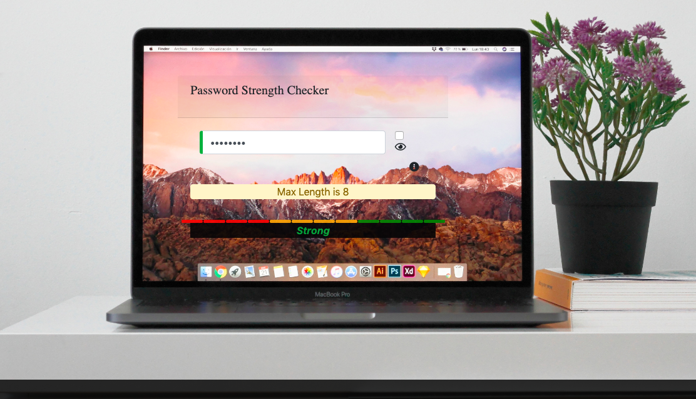

# Password Strength Indicator - Angular5 
Simple POC 

## Getting Started
There are few easy steps:
- clone the repository
- cd to the directory with the repository
- run `npm install` 
- install angular CLI `npm i -g @angular/cli`
- run the app using `ng serve` then 